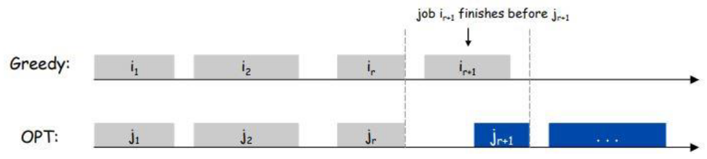
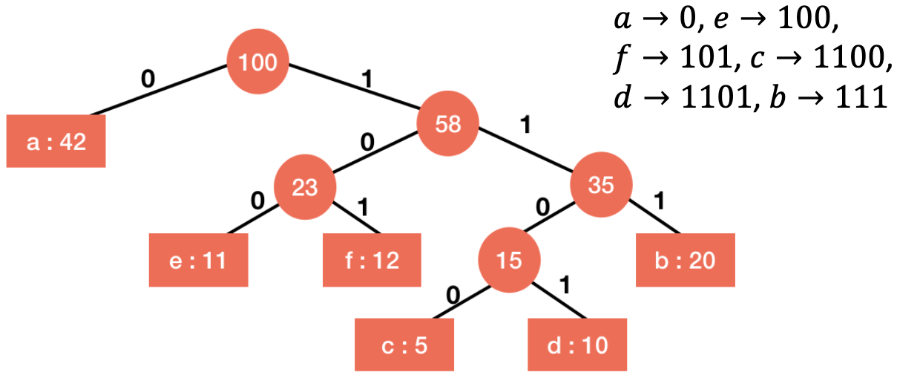

# Greedy Algorithms

$$
\newcommand{\ds}{\displaystyle}
\newcommand{\curlies}[1]{\left\lbrace #1 \right\rbrace}
\newcommand{\abs}[1]{\left\lvert #1 \right\rvert}

\newcommand{\BigO}{\mathcal{O}}
$$

## Greedy Algorithms

A **greedy algorithm** is one that makes choices that have the greatest immediate benefit to build up a solution to a maximization problem.

Greedy algorithms are rarely optimal, but are often very good approximations.

## Interval Scheduling

Suppose we have a set $J$ of $n$ jobs, and each job $j \in J$ starts at $s_j$ and finishes at $f_j$. We say two jobs are **compatible** if they don't overlap.

Our goal is to find a maximum-size subset of $J$ of **mutually compatible** jobs, i.e. jobs that are all compatible with each other.

### Greedy algorithm

1. Sort jobs in order of earliest finish time

   - this step takes $\BigO(n\log n)$ time because that is how long sorting takes

   - other orderings such as start time, duration, fewest conflicts do not lead to optimal solution

2. When deciding if job $j$ should be scheduled, check if it is compatible with previously scheduled jobs

   - previously scheduled jobs are sublist of sorted list, so they are sorted by finish time
   - suppose $i$ is last job added to schedule
   - to see if $j$ starts after previous jobs, only need to check if $f_i < s_j$
     - this takes $\BigO(1)$ per job
   - this step takes $\BigO(n)$ time

### Greedy algorithm is optimal - Proof by induction

We want to prove that for all $k \in \N$, there is an optimal solution $O = \curlies{j_1, ..., j_m}$ that matches the greedy solution $G = \curlies{i_1, ..., i_\ell}$ for the first $k$ jobs.

<u>Base case:</u>

If $k = 0$, then this holds trivially.

<u>Inductive step:</u>

Suppose the first $k$ jobs in $G$ match the first $k$ jobs in $O$. Then, since the greedy algorithm chooses the available job with the earliest finishing time, $f_{i_{k+1}} \leq f_{j_{k+1}}$, so we can find another optimal solution $O' = (O \setminus \curlies{j_{k+1}}) \cup \curlies{i_{k+1}}$ which matches $G$ for the first $k+1$ terms.

### Greedy algorithm is optimal - Proof by contradiction

This proof is essentially the same as the one above, but I don't like it as much.

Suppose for contradiction that the greedy algorithm above is not optimal, and it selects a list of jobs $G = \curlies{i_1, ..., i_k}$ (sorted by finish time) that is not an optimal solution.

Let $O = \curlies{j_1, ..., j_m}$ (sorted by finish time) be the optimal solution that matches the greedy solution for as long as possible. This means $i_1 = j_1$, $i_2 = j_2$, ..., $i_r = j_r$ for the greatest possible $r$, so $i_{r+1} \neq j_{r+1}$.

Since the greedy algorithm decided to schedule $i_{r+1}$, we know that $f_{i_{r+1}} \leq f_{j_{r+1}}$.

Then, if we create $O' = (O \setminus \curlies{j_{r+1}}) \cup \curlies{i_{r+1}}$, aka $O$ but with $j_{r+1}$ replaced by $i_{r+1}$, we get another optimal solution. However, $O'$ matches the greedy solution for longer than $O$. as it matches for the first $r+1$ jobs rather than the first $r$. However, we have reached a contradiction since we assumed that $O$ matches $G$ for as long as possible. Thus, $G$ must be optimal.

## Interval Partitioning

This problem has the same setup as the previous one: We have a set $J$ of $n$ jobs, each job $j \in J$ starts at $s_j$ and finishes at $f_j$.

This time, our goal is to partition $J$ into the smallest number of groups of mutually compatible jobs.

So we want to create a partition $P = \curlies{S_1, ..., S_n}$ of $J$, where jobs in each $S_i$ are mutually compatible, and minimize $\abs P$.

### Greedy algorithm

1. Sort jobs in order of earliest start time

   - takes $\BigO(n\log n)$ time

   - other orderings such as finish time, duration, fewest conflicts do not lead to optimal solution

2. For each $S_i$, let $t_i$ be the finish time of the last job in $S_i$. Store priority queue of $(i, t_i)$ pairs (in increasing order of $t_i$), so that at each step we know which $S_i$ has the earliest time available to schedule new jobs

3. For each job $j$, find the best group to put it in

   - extract the minimum from the priority queue until we find $S_i$ so that $s_j \geq t_i$, and schedule $j$ in $S_i$
   - if no such $S_i$ is found, create a new group $S$ in $P$ and schedule $j$ in it

### Greedy algorithm is optimal

The **depth** of a solution is the size of the partition created, $\abs P$. An optimal solution would have minimum depth, which is equal to the maximum number of jobs happening at any point in time. i.e., if $s_1 \leq t \leq f_1$, ..., $s_n \leq t \leq f_n$, then the depth of any solution is at least $d_t = n$. Thus, the depth of every solution is at least $\ds \max_t d_t$, so the depth of the optimal solution is exactly that.

In step 3, when scheduling job $j$, a new group in the partition is only created if no available group is found. That means that in every group, there is a job that hasn't finished by $s_j$. Since we sorted the jobs by their start time, this means that jobs with start time less than $s_j$ have not finished yet. Thus, they all overlap at time $s_j$, so when we create a new group we now have $d_{s_j}$ groups in total. $\ds d_{s_j} \leq \max_t d_t$ by definition, so we have not made a choice that renders the solution non-optimal.

Using induction, we can extend this argument to show that the greedy algorithm is optimal.

## Interval graphs

Interval scheduling and partitioning can be interpreted as graph problems.

We can define a graph $G = (V, E)$ by

- $V = J$ is the set of jobs
- $(i, j) \in E$ if jobs $i$ and $j$ are incompatible

We can solve the interval scheduling problem by finding a **[maximal independent set](https://en.wikipedia.org/wiki/Maximal_independent_set)** (MIS) in the interval graph, i.e. the greatest set of vertices that do not have any edges between them.

We can find the interval partitioning problem by **[colouring](https://en.wikipedia.org/wiki/Graph_coloring)** the interval graph with the least number of colours.

Note that these two problems are NP-hard (probably can't be solved fast), yet our greedy solutions above are pretty fast. This is because the interval problems we solved have stronger conditions than general MIS and colouring problems.

In general, a graph is an **[interval graph](https://en.wikipedia.org/wiki/Interval_graph)** if it can be represented as an interval problem. These are the graphs for which we can use our above greedy algorithms to solve the MIS and colouring problems quickly. We can also generalize these algorithms further to [chordal graphs](https://en.wikipedia.org/wiki/Chordal_graph).

## Minimizing Lateness

Suppose we have a single machine and a list of jobs $J$, and each job $j \in J$ requires $t_j$ units of time and is due by time $d_j$. If we schedule the job to start at $s_j$, then its finishing time is $f_j = s_j + t_j$. The **lateness** of $j$ is $\ell_j = \max\curlies{0, f_j - d_j}$.

We want to minimize the lateness of the latest job, i.e. we want to minimize $\ds L = \max_{j \in J} \ell_j$.

We need to find the best ordering of the jobs. Some natural orderings are:

- shortest processing time first
  - sort $J$ in ascending order of $t_j$
  - doesn't work because longer jobs may have earlier deadlines
- smallest slack first
  - sort $J$ in ascending order of $d_j - t_j$
  - jobs with smaller slack may have later deadlines
- earliest deadline first
  - sort $J$ in ascending order of $d_j$
  - this one is optimal

### Greedy algorithm

1. Sort $J$ in increasing order of $d_j$
2. Do jobs in order with no idle time in between

### Greedy algorithm is optimal

#### Inversions

There is always an optimal solution without any idle time (i.e. time where no job is scheduled between two jobs), and the greedy algorithm does not have any idle time.

Define an **inversion** to be a pair of jobs $(i, j)$ so that $d_i < d_j$ but $j$ is scheduled before $i$. Note that the earliest deadline first strategy will never result in any inversions.

If a schedule with no idle time has at least one inversion, then it has an inversion $(i, j)$ where $i$ is scheduled immediately after $j$.

#### Fixing inversions

Consider swapping $i$ and $j$, changing the lateness $L$ to $L'$ and the individual latenesses $\ell_j$ and $\ell_j$ to $\ell_i'$ and $\ell_j'$ and similarly with the finish times. Then $f_i = f_j'$, so

$$
\ell_j' = f_j' - d_j = f_i - d_j \leq f_i - d_i = \ell_i
$$

Thus $\ell_j' \leq \ell_i$. We can also clearly see that $\ell_i' \leq \ell_i$, since $f_i'$ is earlier than $f_i$.

Then, considering the lateness of the solution,

$$
L' = \max\curlies{\ell_i', \ell_j', \max_{k \notin\curlies{i, j}} \ell_k'}
$$

Since we did not reschedule any job $k \notin \curlies{i, j}$, $\ell_k = \ell_k'$, so

$$
\begin{align*}
L' &= \max\curlies{\ell_i', \ell_j', \max_{k \notin \curlies{i, j}} \ell_k} \\
&\leq \max\curlies{\ell_i, \max_{k \notin \curlies{i, j}} \ell_k} \tag{since $\ell_i', \ell_j' \leq \ell_i$} \\
&= \max_{k \neq j} \ell_k \\
&\leq \max_k \ell_k \\
&= L
\end{align*}
$$

So the lateness does not increase, but the number of inversions has decreased.

#### Proof of optimality

Now, suppose that the greedy algorithm, sorting by earliest deadline first, is not optimal. Consider an optimal schedule $S^*$ with the fewest inversions among all optimal schedules. Suppose without loss of generality that it does not have any idle time.

Since the earliest deadline first algorithm is not optimal, $S^*$ must have at least one inversion. Then, by the work above, at least one inversion must be between adjacently scheduled jobs. This inversion can be fixed without increasing lateness, so we arrive at another schedule $T^*$ which has lateness at most the same as $S^*$, but with one fewer inversion. This is a contradiction, as we assumed that $S^*$ had the least inversions! So the greedy algorithm must be optimal.

# Lossless Compression

We have a document that is written with $n$ distinct symbols, and we want to compress it losslessly to use the minimum amount of space.

In real life documents, some symbols (e.g. $a$, $e$, $r$, $s$) show up much more frequently than others (e.g. $x$, $q$, $z$), so we want to use shorter codes for more frequent symbols. However, if we use codes where other codes are prefixes, then this can become ambiguous. For example, if we encode $a$ with 0, $e$ with 1, and $r$ with $01$, then does 01 represent $r$ or $ae$?

Thus we want a **prefix-free encoding**.

### Greedy algorithm - Huffman coding

1. Build a priority queue $Q$ of tree nodes, fill the queue with nodes $(x, f_x)$ of symbol $x$ and frequency $f_x$.
2. While $\abs Q > 1$, extract the two lowest frequency nodes $n_0$ and $n_1$ from $Q$ and make them the children of a new node ($n_1$ on the left and $n_0$ on the right) whose frequency is $f_0 + f_1$, insert this new node back into $Q$
3. Label the nodes based on the path to them from the route, with a 0 for every step left and 1 for every step right. Encode the document with the resulting code.

### Huffman coding is optimal

Suppose $f_x$ and $\ell_x$ are the frequency and length of the code for a symbol $x$.

#### Length lemma

We will prove that for any optimal encoding, if $f_x < f_y$, then $\ell_x \geq \ell_y$.

Suppose for contradiction that $f_x < f_y$ and $\ell_x < \ell_y$. Then the overall length of all encoded $x$ and $y$ symbols in the document is $f_x \cdot \ell_x + f_y \cdot \ell_y$. However, since $f_y - f_x > 0$ and $\ell_y - \ell_x > 0$,

$$
\begin{align*}
(f_y - f_x)(\ell_y - \ell_x) &> 0 \\
f_x \cdot \ell_x + f_y \cdot \ell_y &> f_x \cdot \ell_y + f_y \cdot \ell_x
\end{align*}
$$

so we can reach a *strictly* smaller encoded length just by swapping the lengths of $x$ and $y$, so the encoding could not have been optimal.

#### Sibling lemma

If $x, y$ are the two symbols with the lowest frequency, then there is an optimal tree $T$ where $x$ and $y$ are siblings.

Suppose $T$ is optimal, then $x$ must have the longest encoding (by the length lemma above). Due to optimality, $x$ must have a sibling (???). If that sibling $z$ is not $y$, then swap it with $y$. This does not change the length of the encoding, since if $z$ was a sibling to $x$ then it must have also had the same frequency as $y$. (?) Thus we have found an optimal tree where $x$ and $y$ are siblings.

#### Proof of optimality

Suppose $x, y$ are the symbols with the lowest frequency, so the algorithm combines them in its first step, let $H$ be the Huffman tree produced. Let $T$ be an optimal tree where $x$ and $y$ are siblings, we know from above that this is possible. $H'$ and $T'$ are $H$ and $T$ but treating $xy$ as one symbol with frequency $f_x + f_y$.

[...]