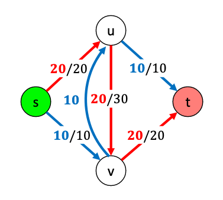

# Network Flow

$$
\newcommand{\ds}{\displaystyle}
\newcommand{\curlies}[1]{\left\lbrace #1 \right\rbrace}
\newcommand{\abs}[1]{\left\lvert #1 \right\rvert}

\newcommand{\BigO}{\mathcal{O}}
$$

Network flow began as a study of finding min cuts (defined below), so that the US could find out how to efficiently disable the Soviet rail network in the 1930s in case of war.

## Network Flow

Suppose we have a directed graph $G = (V, E)$ where each edge has a **capacity**, i.e. we have a function $c: E \to \R_{\geq 0}$, and we are given source and target vertices $s, t \in V$. We want to find the maximum "flow" from $s$ to $t$.

An **$s$-$t$ flow** is a function $f: E \to \R_{\geq 0}$. Intutively, it is an assignment of "amount of material" carried on each edge $e \in E$. $f$ must respect two constraints:

1. Capacities - for every edge $e$, $f(e) \leq c(e)$

2. Conservation - for every vertex $v$ (aside from $s$ and $t$), the flow coming in is equal to the flow going out, aka

$$
f^{in}(v) = \sum_{e=(x,v)} f(e) = \sum_{e=(v,y)} f(e) = f^{out}(v)
$$

We define the **value** of the flow $v(f)$ as 

$$
v(f) = f^{out}(s) = f^{in}(t)
$$

We want to find a flow $f^*$ with the greatest value.

## Greedy approach

1. Start from zero flow - set $f(e) = 0$ for each $e$
2. While there exists an $s$-$t$ path $P$ in $G$ such that $f(e) < c(e)$ for each $e \in P$
   - increase $f(e)$ by $\ds \min_P(c(e) - f(e))$ (bottleneck) for each $e \in P$

This algorithm does not work because it makes irrevocable decisions, so it cannot reverse bad decisions.

## Ford-Fulkerson Algorithm

### Residual Graphs

To come up with an algorithm where we can reverse bad decisions, we will "reverse" flow in the following way:



In concrete terms, this results in reducing the flow between $u$ and $v$ by $10$, but we can think of it as reversing the direction of the flow.

To make this more concrete, we can define a **residual graph** $G_f = (V, E_f)$ with the same vertices as $G$, but with $E_f$ containing:

- **forward edges**, which are edges $e \in E$ where $c(e) - f(e) > 0$
  - their capacity is $c_f(e) = c(e) - f(e)$
  - $e \in E_f$ represents how much flow can add to $e \in E$
- **backward edges**, which are edges $e^{rev} = (v, u)$ where $e = (u, v) \in E$ and $f(e) > 0$
  - their capacity is $c_f(e) = f(e)$
  - $e^{rev} \in E_f$ represents how much flow we can remove from $e \in E$

### Augmenting paths

Let $P$ be an $s$-$t$ path in $G_f$ and $x = \text{bottleneck}(P, f)$ be the smallest capacity $c_f(e)$ across all edges $e \in P$. Define **augmenting** $P \subseteq E_f$ as:

- if $e \in P$ is a forward edge, then increase $f(e)$ by $x$
- if $e^{rev} \in P$ is a reverse edge, then decrease $f(e)$ by $x$

Then we can create a new flow $f'$ by augmenting $P$. This is a valid new flow because it satisfies the two constraints. It satisfies the capacity constraint:

- if $f(e)$ is increased, then that means the forward edge $e \in P$ has capacity $c_f(e) = c(e) - f(e)$. Since $x$ is the smallest capacity, $x \leq c(e) - f(e)$, so $f(e) + x \leq c(e)$.
- if $f(e)$ is decreased, then that means the backward edge $e^{rev} \in P$ has capacity $c_f(e^{rev}) = f(e)$. Since $x$ is the smallest capacity, $x \leq f(e)$, so $f(e) - x \geq 0$.

It also satisfies the conservation constraint. Suppose $v$ is an inner node (aka not $s$ or $t$) along the path. Then it has two edges incident to it in $P$, $e_1$ and $e_2$.

- suppose both $e_1$ and $e_2$ are forward edges, then $x$ has been added to both the flow coming in and the flow going out, so flow is conserved at $v$
- suppose both $e_1$ and $e_2$ are backward edges, then similarly $x$ is subtracted from both the flow coming in and going out, so flow is conserved
- suppose $e_1$ is a forward edge and $e_2 = e^{rev}$ is a backward edge, then $f(e_1)$ is increased by $x$ but $f(e^{rev})$ is decreased by $x$, so the flows coming in and going out of $v$ are unchanged
- the same holds when $e_1$ is a backward edge and $e_2$ is a forward edge

### The Ford-Fulkerson Algorithm

The Ford-Fulkerson algorithm is simply to augment paths in $G_f$ until there are no longer any paths left to augment.

```python
def MaxFlow(G):
    for edge e in G:
        f(e) = 0
    while P = FindPath(s, t, Residual(G, f)) != None:
        f = Augment(f, P)
    return f
```

### Running time

Let $\ds C = \sum_{e = (s, v) \in E} c(e)$ be the sum of capacities of edges leaving the starting node $s$. Each augmentation increases flow by at least 1, which means that flow out of $s$ is increased by at least 1. Since the flow out of $s$ is at most $C$, this means that we can have at most $C$ augmentations.

Each augmentation is on a path in $G_f$, which has $n$ vertices and at most $2m$ edges. Thus, finding an $s$-$t$ path takes $\BigO(n + m)$ time.

Since a path is found for each augmentation, the total running time is $\BigO((n + m) \cdot C)$.

This is *pseudo-polynomial time*, since $C$ can be exponentially large in the input length (number of bits to specify capacity).

### Correctness

#### Cuts

An **$s$-$t$ cut** is a partition $(A, B)$ of $V$ (aka $A \sqcup B = V$) where $s \in A$ and $t \in B$.

Its **capacity** $cap(A, B)$ is the sum of capacities of edges leaving $A$, i.e.

$$
cap(A, B) = \sum_{e \text{ leaving } A} c(e)
$$

For any flow $f$ and any $s$-$t$ cut $(A, B)$, $v(f) = f^{out}(A) - f^{in}(A)$. This is because

[...]

Furthermore, for any flow $f$ and $s$-$t$ cut $(A, B)$, $v(f) \leq cap(A, B)$. This is because

$$
\begin{align*}
v(f) &= f^{out}(A) - f^{in}(A) \\
&\leq f^{out}(A) \\
&= \sum_{e \text{ leaving } A} f(e) \\
&\leq \sum_{e \text{ leaving } A} c(e) \\
&= cap(A, B)
\end{align*}
$$

This means that the maximum value of any flow is less than or equal to the minimum capacity of any $s$-$t$ cut. Thus, if we find a flow whose value is the capacity of a cut, then we know that the flow is optimal.

#### Ford-Fulkerson finds a flow that is the capacity of a cut

Suppose $f$ is the flow that is found by the Ford-Fulkerson algorithm. Let $A$ be the nodes reachable from $s$ in $G_f$ and $B = V \setminus A$ be the remaining nodes. Since the algorithm terminates when there is no path in $G_f$ from $s$ to $t$ in $G_f$, we know that $t$ must not be reachable from $s$, so $B$ must contain $t$. This means that $(A, B)$ is an $s$-$t$ cut. Note that we are working with $G_f$, but we consider $(A, B)$ to be a cut of $G$ itself.

Suppose $e = (u, v)$ is an edge from $u \in A$ to $v \in B$ in $G$. If $c(e) - f(e) > 0$, then $e$ is also $G_f$. Since $u$ is reachable from $s$ and $(u, v)$ is in the residual graph, $v$ would also be reachable from $s$. But this contradicts the assumption that $v \in B$, so we must have $f(e) = c(v)$.

Suppose $e = (v, u)$ is an edge from $v \in B$ to $u \in A$ in $G$. If $f(e) > 0$, then $e^{rev} = (u, v)$ would be in the residual graph, so once again $v$ would be reachable from $s$, again a contradiction.

Thus, for each edge $e_o$ from $A$ to $B$, $f(e_o) = c(e_o)$, and for each edge $e_i$ from $B$ to $A$, $f(e_i) = 0$. Thus,

$$
\begin{align*}
v(f) &= f^{out}(A) - f^{in}(A) \\
&= \sum_{e_o \text{ leaving } A} f(e_o) - \sum_{e_i \text{ entering } A} f(e_i) \\
&= \sum_{e_o \text{ leaving } A} c(e) - 0 \\
&= cap(A, B)
\end{align*}
$$

Since this flow's value is the capacity of an $s$-$t$ cut, we know that it is the maximum possible flow.

### Integrality Theorem

Notice that if all edge capacities are integers, the Ford-Fulkerson algorithm will preserve integrality, i.e. the computed flow will also consist of integers.

### Faster algorithms

The Edmonds-Karp algorithm is a faster strategy, it is discussed in detail below.

We can also change the Ford-Fulkerson algorithm to always look for the maximum bottleneck path each iteration, which would change it to take $\BigO(m^2 \log(C))$ time, which is considered *weakly polynomial time*.

The current best solution to the problem, by Orlin, runs in $\BigO(nm)$ time.

## Edmonds-Karp Algorithm

The Edmonds-Karp algorithm is essentially the Ford-Fulkerson algorithm, but with smarter choice of path to augment - it always finds and augments the shortest path, using breadth-first search. Its runtime is $\BigO(nm^2)$, which is what we consider *strongly polynomial time*.

```python
def MaxFlow(G):
    for edge e in G:
        f(e) = 0
    while P = BFS(s, t, Residual(G, f)) != None:
        f = Augment(f, P)
    return f
```

Clearly this is still correct, as our proof of the correctness of the Ford-Fulkerson algorithm relied on each found path being arbitrary, so it applies to these specific BFS paths as well.

### Level graphs

Let the **level** $\ell(v)$ be the length of the shortest path from $s$ to $v$. Then the **level graph** $L_G = (V, E_L)$ is a subgraph of $G$ where $E_L \subseteq E$. An edge $(u, v) \in E$ is also in $E_L$ if $\ell(u) + 1 = \ell(v)$, i.e. if it is useful to find shortest paths.

The level graph has the property that $P$ is a shortest path from $s$ to $v$ in $G$ if and only if $P$ is also a path in $G$. 

### Length of shortest $s$-$t$ path in $G_f$ never decreases

Suppose $f$ is a flow and $f' = \text{Augment}(f, P)$ where $P$ is a path chosen by the Edmonds-Karp algorithm, i.e. by BFS. Let $G_f$ and $G_{f'}$ be their corresponding residual graphs. Since $P$ is a shortest path from $s$ to $t$, it is in $L_{G_f}$. When we augment our flow along $P$, for each edge in $P$, we either remove the edge, add an opposite direction edge, or both.

[...]

Neither of these directions allow us to reduce the length of the shortest $s$-$t$ path, so the length of the shortest path never decreases in the Edmonds-Karp algorithm.

### It takes at most $m$ augmentations for the length of the shortest $s$-$t$ path in $G_f$ to increase

In each augmentation step, we remove at least one edge from $L_{G_f}$, since augmenting increases the flow on at least one edge to its capacity. No new edges are added to $L_{G_f}$ unless the length of the shortest $s$-$t$ path strictly increases. However, at most $m$ edges can be removed from $L_{G_f}$, so this is an upper bound on how many times we can augment without increasing the length of the shortest $s$-$t$ path.

### Running time

The length of the shortest $s$-$t$ path is anywhere between 0 and $n-1$. The length of the shortest $s$-$t$ path never decreases, so it increases from its initial length to at most $n-1$, until no path exists from $s$ to $t$. Thus, it increases $\BigO(n)$ times. Each of these increases takes at most $m$ augmentations, it takes $\BigO(nm)$ augmentations for the algorithm to finish. Breadth-first search takes $\BigO(m)$ time, so this is the complexity for each augmentation. Thus, in total the algorithm takes $\BigO(nm^2)$ time.

## Bipartite Matching

Given an undirected bipartite graph $G = (V_G = U \sqcup V, E)$, find a maximum cardinality matching.

We do not currently have an efficient greedy algorithm or dynamic programming algorithm to solve this problem, however we can reduce it to a network flow problem.

We do this by creating a directed flow graph $F = (V_F, E_F)$ where:

- $V_F = V_G  \cup \curlies{s, t}$, i.e. we have added a start node and a target node
- $(s, u) \in E_F$ for every $u \in U$, i.e. the start node flows into every node of $U$
- $(v, t) \in E_F$ for every $v \in B$, i.e. every node of $V$ flows into the target node
- $(u, v) \in E_F$ for every $(u, v) \in E$ where $u \in U$ and $v \in V$
- $c(e) = 1$ for every $e \in E_F$

Clearly, every flow of value $k$ in $F$ is isomorphic to a matching of $G$, and vice versa.

## Perfect matching

Perfect matching is bipartite matching for a graph $G = (U \sqcup V, E)$ where $\abs U = \abs V = n$.

In this case, there would be $n$ edges of capacity 1 coming out of $s$, so the Ford-Fulkerson algorithm would take $\BigO(mn + n^2)$ time.

Some variants of Ford-Fulkerson have better time complexity for this problem, for example Dinitz's algorithm takes $\BigO(m \sqrt n)$ time when every edge capacity is 1.

### Neighbourhoods of subsets of $U$

For $S \subseteq U$, define the neighbourhood of $S$, $N(S)$ to be the set of nodes in $V$ adjacent to some node in $S$, so

$$
N(S) = \curlies{v \in V : (u, v) \in E, u \in S}
$$

### Hall's Marriage Theorem

We will now consider a different flow network, and treat it in a way that is equivalent to bipartite matching. Consider the flow graph $F = (V_F, E_F)$ which is constructed in the same way as in the general bipartite matching case, except that edges from $U$ to $V$ all have capacity. That is, if $e = (u, v)$ where $u \in U$ and $v \in V$, then $c(e) = \infty$.

Hall's marriage theorem states that $G$ has a perfect matching if and only if $\abs{N(S)} \geq S$ for every $S \subseteq V$.

($\Rightarrow$) If $G$ has a perfect matching, then $\abs{N(S)} \geq \abs S$. If this were not the case, then there would not exist a one-to-one pairing of $S$ with $N(S)$, so matching would be impossible.

($\Leftarrow$) Suppose $G$ does not have a perfect matching, then the value of the maximum flow on our graph must be less than $n$. However, we know that the value of the maximum flow is the capacity of the minimum cut, so there must be an $s$-$t$ cut of $F$ with capacity less than $n$.

Suppose $(A, B)$ is this minimum cut, and consider the edges leaving $A$.  None of these go from $U$ to $V$, as these would have infinite capacity, so $cap(A, B)$ would be infinite. However, $cap(A, B)$ is finite, so this is not the case. There can only be edges of finite capacity, so the edges leaving $A$ can only be from $s$ to $U$ and from $V$ to $t$. Since these are edges leaving $A$, note that this implies that the edges are from $s$ to $U \cap B$ and from $V \cap A$ to $t$.

$cap(A, B)$ is the sum of capacities for each of these edges, aka 1 for every edge leaving $A$. Thus,

$$
\begin{align*}
cap(A, B) &< n \\
\abs{U \cap B} + \abs{V \cap A} &< n \\
\abs{U \cap B} + \abs{V \cap A} &< \abs U \\
\abs{V \cap A} &< \abs U - \abs{U \cap B} \\
\abs{V \cap A} &< \abs{U \cap A}
\end{align*}
$$

Since none of the edges leaving $A$ have infinite capacity, none of them are between $U \cap A$ and $V \cap B$. Thus, $N(U \cap A) \subseteq V \cap A$. Thus,

$$
\abs{N(U \cap A)} \leq \abs{V \cap A} < \abs{U \cap A}
$$

Thus, we have proven the converse: if there is no perfect matching, then $\abs{N(S)} < \abs S$ for some $S \subseteq U$.

## Edge-Disjoint Paths


## Circulation

Given a directed graph $G = (V, E)$, edge capacities $c: E \to \N$, and node demands $d: V \to Z$, we want a circulation $f: E \to \N$ satisfying:

- for each $e \in E$, $0 \leq f(e) \leq c(e)$
- for each $v \in V$, $\ds \sum_{e \text{ entering } v} f(e) - \sum_{e \text{ leaving } v} f(e) = d(v)$

### Network flow formulation

We can equivalently formulate a circulation problem as a network flow problem. We do this by considering a new graph $G' = (V', E')$ which is $G$ but with a source node $s$ and target node $t$ added. $s$ is adjacent to every node in $G$ that has a negative demand, and $t$ is adjacent to every node in $G$ that has positive demand. Then we want the value of the flow to be

$$
\sum_{v \in V : d(v) > 0} d(v) = \sum_{v \in V : d(v) < 0} -d(v)
$$

in order to solve the original circulation problem.

## Circulation with Lower Bounds

Consider the circulation problem, however with added lower bound constraints - for every $e \in E$, $\ell(e) \leq f(e) \leq c(e)$.

We can convert this to a normal circulation problem by doing the following for each edge $e = (u, v)$:

- $c(e) \gets c(e) - \ell(e)$
- $d(u) \gets d(u) + \ell(e)$
- $d(v) \gets d(v) - \ell(e)$
- forget about $\ell(e)$


## Survey Design

## Image Segmentation

## Profit Maximization