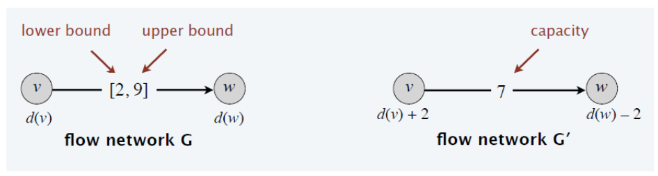

# Network Flow

$$
\newcommand{\ds}{\displaystyle}
\newcommand{\curlies}[1]{\left\lbrace #1 \right\rbrace}
\newcommand{\abs}[1]{\left\lvert #1 \right\rvert}

\newcommand{\BigO}{\mathcal{O}}
$$

## Network Flow

Suppose we have a directed graph $G = (V, E)$ where each edge has a **capacity**, i.e. we have a function $c: E \to \R_{\geq 0}$, and we are given source and target vertices $s, t \in V$. We want to find the maximum "flow" from $s$ to $t$.

An **$s$-$t$ flow** is a function $f: E \to \R_{\geq 0}$. Intutively, it is an assignment of "amount of material" carried on each edge $e \in E$. $f$ must respect two constraints:

1. Capacities - for every edge $e$, $f(e) \leq c(e)$

2. Conservation - for every vertex $v$ (aside from $s$ and $t$), the flow coming in is equal to the flow going out, aka

$$
f^{in}(v) = \sum_{e=(x,v)} f(e) = \sum_{e=(v,y)} f(e) = f^{out}(v)
$$

We define the value of the flow $v(f)$ as 

$$
v(f) = f^{out}(s) = f^{in}(t)
$$

We want to find a flow $f^*$ with the greatest value.

## Greedy approach

1. Start from zero flow - set $f(e) = 0$ for each $e$
2. While there exists an $s$-$t$ path $P$ in $G$ such that $f(e) < c(e)$ for each $e \in P$
   - increase $f(e)$ by $\ds \min_P(c(e) - f(e))$ (bottleneck) for each $e \in P$

This algorithm does not work because it makes irrevocable decisions, so it cannot reverse bad decisions.

## Residual graphs

To come up with an algorithm where we can reverse bad decisions, we will "reverse" flow in the following way:

In concrete terms, this results in reducing the flow between $u$ and $v$ by $10$, but we can think of it as reversing the direction of the flow.

To make this more concrete, we can define a **residual graph** $G_f$ with the same vertices as $G$, but with a reverse of each edge added. If $e = (u, v) \in E$, then $E_f$ contains both $e$ and $e^{rev} = (v, u)$. Edges in $E \subseteq E_f$ have the same capacity, but reversed edges $e^{rev}$ have capacity $f(e)$.

We can convert a solution on a residual graph to a solution to the original problem by using $f(e) - f(e^{ref})$ as the flow for each $e \in E$.

## Ford-Fulkerson Algorithm

[...]

## Edmonds-Karp Algorithm

[...]

## Network Flow Applications

Network flow began as a study of finding min cuts, so that the US could find out how to efficiently disable the Soviet rail network in the 1930s in case of war

### Integrality matrix

## Circulation

Given a directed graph $G = (V, E)$, edge capacities $c: E \to \N$, and node demands $d: V \to Z$, we want a circulation $f: E \to \N$ satisfying:

- for each $e \in E$, $0 \leq f(e) \leq c(e)$
- for each $v \in V$, $\ds \sum_{e \text{ entering } v} f(e) - \sum_{e \text{ leaving } v} f(e) = d(v)$

### Network flow formulation

We can equivalently formulate a circulation problem as a network flow problem. We do this by considering a new graph $G' = (V', E')$ which is $G$ but with a source node $s$ and target node $t$ added. $s$ is adjacent to every node in $G$ that has a negative demand, and $t$ is adjacent to every node in $G$ that has positive demand. Then we want the value of the flow to be $\ds \sum_{v \in V : d(v) > 0} d(v) = \sum_{v \in V : d(v) < 0} -d(v)$ in order to solve the original circulation problem.

## Circulation with Lower Bounds

Consider the circulation problem, however with added lower bound constraints - for every $e \in E$, $\ell(e) \leq f(e) \leq c(e)$.

We can convert this to a normal circulation problem by doing the following for each edge $e = (u, v)$:

- $c(e) \gets c(e) - \ell(e)$
- $d(u) \gets d(u) + \ell(e)$
- $d(v) \gets d(v) - \ell(e)$
- forget about $\ell(e)$

